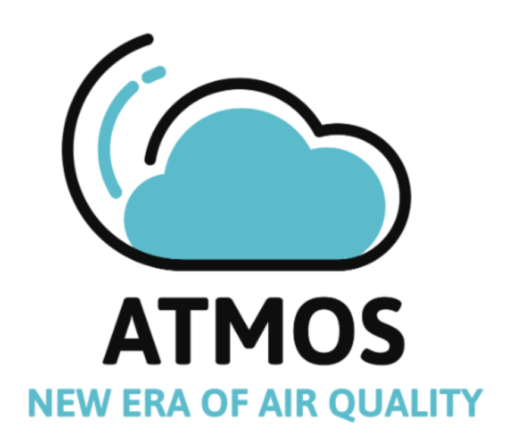

<!-- PROJECT LOGO -->
 

  

  <h3 align="center">ATMOS project</h3>

  

    An IoT and AI transformation!
  

<!-- ABOUT THE PROJECT -->
## About The Project

[![Product Name Screen Shot][product-screenshot]](https://example.com)

This project combines IoT and AI to monitor temperature factors in real-time and generate predictions based on collected data. The system is designed to provide insights on temperature trends, predict anomalies, and contribute to climate or environmental monitoring efforts.

  
  

(<a href="#readme-top">back to top</a>)

<!-- USAGE EXAMPLES -->
## Usage

This project combines AI and IoT technologies to enable intelligent, data-driven insights from connected devices. Below are some examples of how it can be utilized:

- **Smart Monitoring**: Continuously track environmental or equipment metrics in real-time, using AI to detect anomalies and predict issues before they occur.
- **Predictive Maintenance**: Leverage AI models to analyze sensor data, helping to anticipate and address potential failures in devices or machinery.
- **Data-Driven Automation**: Automate responses based on AI insights, such as adjusting temperature, sending alerts, or activating devices in response to specific conditions.

_For more examples and detailed setup instructions, please refer to the [Documentation](https://drive.google.com/file/d/1ExTNDVxY-jXlGBk0rBzt2Zm-WNsS7tHB/view)_

(<a href="#readme-top">back to top</a>)

<!-- CONTACT -->
## Contact

Mail: dtnghia435@example.com

(<a href="#readme-top">back to top</a>)

